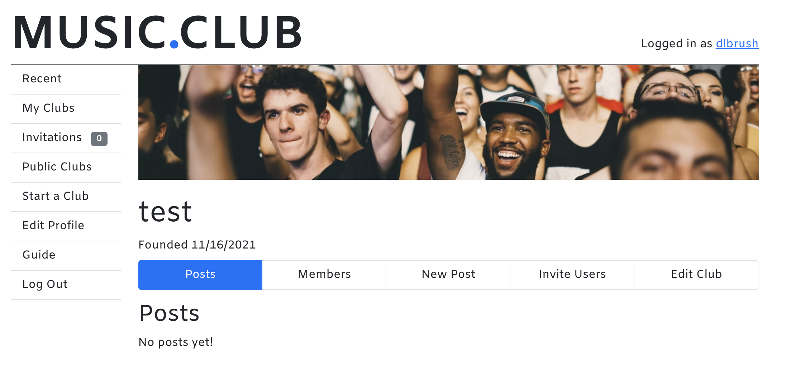
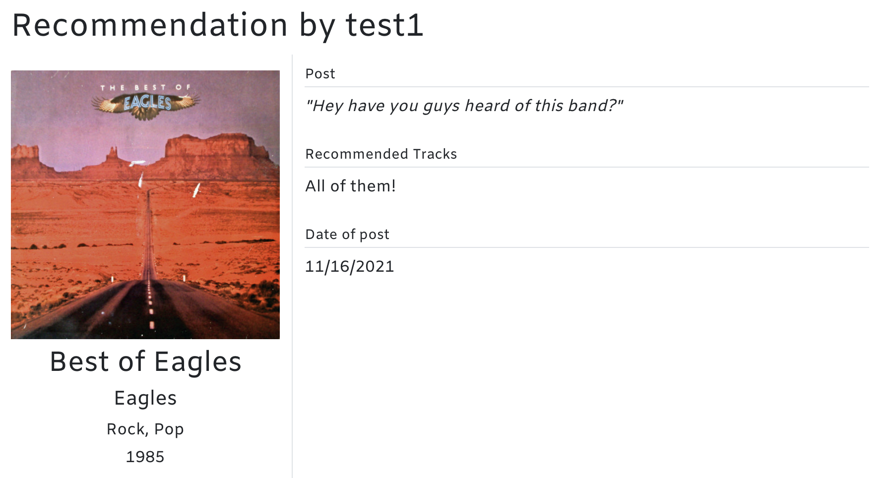

# Music Club (Frontend)

A React single-page frontend for the Music Club app. Uses React Router to handle single-page routing.

Backend repo located here: [https://github.com/dlbrush/music-club-backend](https://github.com/dlbrush/music-club-backend)

## Table of contents

- [Music Club (Frontend)](#music-club-frontend)
  - [Table of contents](#table-of-contents)
  - [Summary](#summary)
  - [Technologies used](#technologies-used)
  - [Starting the app locally](#starting-the-app-locally)
    - [Prerequisites](#prerequisites)
    - [Configuring environment variables](#configuring-environment-variables)
    - [Running the app](#running-the-app)
  - [Database](#database)
    - [Seeding the DB](#seeding-the-db)
  - [Feature Walkthrough](#feature-walkthrough)
    - [Quickstart guide (Standard user flow)](#quickstart-guide-standard-user-flow)
    - [Authentication](#authentication)
    - [Clubs](#clubs)
    - [Invitations](#invitations)
    - [Posts](#posts)
    - [Comments](#comments)
  - [Testing](#testing)
    - [Backend Tests](#backend-tests)
    - [Frontend Tests](#frontend-tests)
  - [API](#api)

## Summary

The Music Club app creates a network of users who post and discuss music in "clubs". A Music Club is intended to be like a book club - post an album for others to listen to, and post comments to discuss it afterwards. Users who sign up for the site can join clubs or start their own and invite their friends. Then, they can search for albums using the Discogs database, and share those albums with their thoughts in any club they're a member of.

The Music Club is intended to be a platform for sharing, discovering, and discussing music with other like-minded users.

## Technologies used

**Backend**
1. PostgresQL database
2. NodeJS backend running an Express server
3. PG for communication between the server and the database

**Frontend**
1. React (via Create-React-App)
2. React Router
3. Bootstrap for styling and responsive design
## Starting the app locally

### Prerequisites

Make sure the following software is installed on your machine before trying to run the app. PostgresQL needs to be running for the app to start.

1. [PostgresQL](https://www.postgresql.org/)
2. [Node.js](https://nodejs.org/)

Also, make sure you have cloned both the [backend](https://github.com/dlbrush/music-club-backend) and [frontend](https://github.com/dlbrush/music-club-frontend) repos. Once you have both repos on your machine, make sure to run `npm i` from the root directory of both in order to install all npm dependencies.

### Configuring environment variables

**Backend**
1. Make a file called .env in the root directory of the backend repo.
2. There should be a file there called .env.example. Copy the contents of this into your .env file.
3. The SECRET_KEY var can be set to any string.
4. The FRONTEND_URI variable needs to be set to whatever URI your frontend will be running from. In the next section I'll recommend setting a port in a .env file in the frontend repo, but the easiest is to have the backend on 3000 and the frontend on 3001. If you don't plan on changing that you can leave it as-is.
5. The DISCOGS_USER_AGENT variable is used to identify the app to the Discogs server. You can use MusicClub as the name, but please specify this with some unique identifier for your version, as MusicClub should be reserved for the deployed app.
6. The trickiest one here is DISCOGS_ACCESS_TOKEN. This is used to authenticate the app's access to the Discogs API. The full OAuth flow for apps to acces Discogs requires each user to have a Discogs account, which is unnecessary for the purposes of this app. So this app uses a personal access token which is much easier to generate. Here's how you do it;
   1. Register for an account on [Discogs](discogs.com)
   2. Go to the [Developer Settings](https://www.discogs.com/settings/developers) page while logged in.
   3. At the bottom of the page, click "Generate new token".
   4. Paste this token into the field for DISCOGS_ACCESS_TOKEN in the .env file. Make sure to keep this a secret, since this token gives access to your personal Discogs account.

**Frontend**
1. Make a file called .env in the root directory of the frontend repo.
2. Because the frontend is built using Create-React-App, there's not much to configure. CRA natively accepts a PORT variable to set the port that the frontend server should run on locally. In my opinion it is easiest to set `PORT=3001` and call it a day, but configure whichever port you'd like here. As noted above, make sure to keep the frontend URI updated in your backend .env or communication between the two halves will break down.

### Running the app

1. Run the backend first so that the frontend can immediately access the API. From the command line in the backend repo root directory, run `npm start` to start the Express server. The server is configured to run on localhost port 3000. 
   - Nodemon is not installed natively for this app, but if you'd like to use nodemon to enable hot reloading (the backend restarts whenever you update a file), install nodemon globally in npm and run `nodemon` from the backend repo. Alternatively, you can run it via npx using `npx nodemon` - this will cache nodemon on your machine while you're using it but does not require a global install.
2. Run the frontend second. The frontend is built on Create-React-App and uses Webpack to load assets, so hot reloading is enabled by default. Run `npm start` from the command line in the root directory of the frontend repo to load the app - it should launch in your browser when loaded.

The backend can run on its own and be accessed via API endpoints using software like [Insomnia](https://insomnia.rest/). Make sure to use the `/auth/register` or `/auth/login` routes to authenticate access to the rest of the routes of the app.

## Database

The database is built on [PostgresQL](https://www.postgresql.org/), and accessed in the app through [node-postgres](https://www.npmjs.com/package/pg).

The frontend accesses the DB entirely by making API calls to the backend. All API calls are made by the API class defined by **api.js** in the frontend root directory.

Database tables are represented by Models in the backend, in the `models` directory. These models have methods to perform basic database operations using [node-postgres](https://www.npmjs.com/package/pg), and return objects with defined properties that can be manipulated and used within the context of the backend for easy access to data.

### Seeding the DB

1. Start PostgresQL on your machine.
2. From this repo on the command line, first run `npm run create-dbs` to create the DB and the test DB.
3. Then run `npm run seed-db` to seed the database. This will give you a test user and a test club to explore.

Test user:

**Username:** 'test1'

**Password:** 'test1'

## Feature Walkthrough

### Quickstart guide (Standard user flow)

- Register for an account, or log in with your existing account! Having an account allows you to join clubs and make posts.
- Check out the list of public clubs, which can be found in the navigation bar. Click on a club name.
- When you open a club, you'll see a list of posts. Click on a post to see more details.
- Click "Members" in the navigation bar at the top of a club page to see the list of members.
- Now that you've seen some clubs, find one you'd like to join and click the "Join Club" button. Or, if none of the clubs suit your fancy, maybe it's time to start your own club - if you want to do that, click on "New Club" in the navigation bar, and add a name and description for your club. Add a link to the image you'd like for your banner - or wait for later, since that's optional. Make it a private club for you and your friends, or a public club for the world to see - totally up to you!
- Now that you're a club member, you can add your own posts. Click "My clubs" in the navigation bar to find the club you just joined. Click on it to open it. You should now have a "New Post" button to click in the nav bar.
- First, you'll need to find an album to recommend. Search by title or artist name. You'll see results from the <a href="www.discogs.com">Discogs</a> album database.
- Once you've chosen an album, click "Next" to move on to filling out the details of your post. Say something about the album and list out the tracks on the album that you recommend. You can write anything in these fields. Click "Post" to add your post.
- Your post is now at the top of the club for everyone to see! Other users in the club can comment on your post - maybe it's time to invite some of your friends to the club to talk about it, using the "Invite Users" button?
- And that's it! Welcome to the club - check in every day to see new posts or talk about what you're listening to.

### Authentication

All features of the app require authentication besides logging in and out, registering a new user, and viewing the homepage and user guide. Make sure you create an account via the frontend or backend before doing anything else. Logging in always requires a username and password.

**Backend**
* Authentication is handled using JsonWebTokens passed as HTTP-only cookies.
  1. When a user hits the `/auth/register` or `/auth/login` routes, a successful request attaches a cookie called `token` to the response. This is a JWT signed using the secret key set in the backend environment. This cookie will be passed along with all further requests to the server. This cookie lasts 24 hours - users will need to re-authenticate if they don't within that time period.
  2. When any request is made to the server, it passes through the `authenticateToken` middleware. This checks for a token cookie in the request, and attaches a `user` property to the Express request object if it can verify an attached JWT. Any further authentication references this user object.
  3. A request to the `auth/logout` route from any user will clear this cookie. Any subsequent request should no longer be authenticated. 
* Because this app sends cookies from the front-end server at a different location, this server needs extra CORS configuration.
  * CORS settings are set to allow requests from the front end using the FRONTEND_URI location specified in the `.env` file.
  * To allow `OPTIONS` requests authenticated with these cookies to send an authenticated response, extra headers need to be set. This is defined in `app.js` at the `app.options` route. Sending these headers allows the consecutive requests to be authenticated successfully.
* Passwords are encrypted in the `/auth` routes using Bcrypt. Only the hashed passwords are stored in the database. Login methods check entered passwords against these hashes.

**Frontend**
* Unauthenticated users can only see the welcome page, the user guide, and the login and register views.
* Logging in or registering will store a cookie in your browser that will leave you logged-in for up to 24 hours.
* When registering, providing a profile image is optional. If no URL is provided, a default profile image is set for the user.
* Users can log out at any time using the `Log Out` button and modal located in the `AppNav` component.

### Clubs

Clubs are where the action happens in the app. This is where posts are made by users to recommend albums to other club members. Then, other club members can comment on them to discuss the albums.

Clubs can be public or private. Public clubs are visible by all users and can be joined by anyone. Private clubs can only be joined by invitation.

**Backend**
* Clubs are created using the `/clubs` route with a POST request. Any logged-in user can create a club. Clubs must have a `name` and `description`. `isPublic` should be set to true for a public club and false for a private club. Optionally, pass a valid URL to add a banner image that will be displayed horizontally on the frontend.
* Get data about a club by passing a valid club ID in a GET request to `/clubs/:clubId`.
* Get an array of all clubs with a GET request to `/clubs`. Only an admin can see all clubs. Any user can see a list of all public clubs by passing a query string containing `isPublic=true`.
* The founder of a club (or admin) can edit a club with a PATCH request to `/clubs/:clubId`, or delete the club with a DELETE request to the same route.
* To join a club, send a POST request to `/users/:username/join-club/:clubId`. Username and club ID must be valid.

**Frontend**
* View all public clubs at `/public-clubs` or by navigating to `Public clubs` from the nav bar. This displays all public clubs in the backend database. Click any club to see a preview version, showing posts without comments and all members of the club.
* View all of the clubs you are a member of by navigating to `/users/:username/clubs` with your own username as the parameter, or by clicking `My Clubs` in the nav bar. This loads club data about all clubs you are a member of from the backend. This is the only place to see the private clubs you are a member of.
* As a logged-in user, navigate to `/new-club` or click `New club` in the nav bar to create a club. Including a banner image is not required, but is encouraged to make your club stand out! Make sure to leave the URL field blank if you want to use the default banner. When you submit, your new club will be added to the backend database.
  * Be careful when choosing if you want to make a Public or Private club - you cannot change this after the club is created!
* To view the posts and members of a club, go to `/clubs/:clubId` or click on the club from a list of public clubs or your own clubs. From here you can navigate around the club. Clubs have their own navigation bar underneath the name of the club. 
  * Go to `clubs/:clubId/posts` to see all posts made in a club, or choose `Posts` from the navigation.
  * Go to `clubs/:clubId/members` to see all members of a club, or choose `Members` from the navigation.
  * You can also make new posts and invite users from this view if you are a member of the club - see the sections on posts and invitations for more information.
* You can join a public club by clicking the "Join Club" button at the top of the club view.
* If you are the founder of a club, you can edit the name, description, and banner of the club by navigating to the "Edit Club" button from the club view or going to `clubs/:clubId/edit-club`. You can also delete the club from this view.

### Invitations

Invitations are required to join private clubs. Invitations can be sent by any user who is a member of a club. Invitations can also be sent to join public clubs, but they are not required.

**Backend**
* To invite another user to a club you are a member of, send a POST request to `/invitations`. Request must contain a body with the `username` being invited and the `clubId` you're inviting them to. 
* To see all invitations to a club, send a GET request to `/clubs/:clubId/invitations` with a valid club ID. You must be a member of the club or an admin.
* To see invitations sent to you, send a GET request to `/users/:username/invitations`, using your own username as the parameter.

**Frontend**
* To invite another user to a club you are a member of: 
  1. Open up the page for that club by navigating there through "My Clubs". Click "Invite Users" from the club's navigation bar.
  2. Search for usernames to invite. The users listed will show "Member" next to their name if they are already a member, or "Invited" if they have already been invited.
  3. Invite the user to the club by clicking "invite" next to their name. The next time they log in, they will have a badge next to their Invitations navigation item saying they have a new invitation.
* Your own invitations can be accessed from the Nav Bar using the Invitations link. If you have new invitations, there should be a red badge next to the word "Invitations" indicating how many new invitations you have.

### Posts

Posts are where the most important information for Music Club is shared: recommended albums! Users can post about any album as long as it's in the Discogs database, which is extensive and should contain the vast majority of music you want to share. 

Users can make posts in any club they are a member of. Posts contain `content`, which is whatever the user wants to say about that album, and `recTracks`, the tracks a user would recommend on that album. Users can input anything in these fields but, they are encouraged to be used to guide the listening experience of other members and explain why the user is recommending the album.

**Backend**
* See all of the posts in a given club by sending a GET request to `/posts?clubId=<club ID>` and passing a valid Club ID. You must be a member of this club, or the club must be public, to access this route. Admins can view posts in any club or get an array of all posts across the entire app by sending the same request without a query string. The results here will contain basic information about the recommended albums as well.
* Get details about a single post by sending a GET request to `posts/:postID` with a valid `postID` parameter. This route will include details about the album recommended, the genres of the album and any comments that have been made on the post.
* Somewhat unintuitively, posts are created by being associated with a club, by sending a POST route to `/clubs/:clubId/new-post`. Some notes here about this:
  * This route expects a body with properties `content`, `recTracks`, and `discogsId`. No properties are optional. There is no limit to the length of either `content` or `recTracks`, `discogsId` should be an integer.
  * Coming from the frontend, `discogsId` is appended based on a search of the discogs Database, so it's pretty difficult to send an inaccurate request there. Coming from the backend, though, make sure to use the `/albums/search` route and use the `title` and `artist` query strings to find a Discogs ID of the album you want to post.
  * When a valid Discogs ID is passed, there is a check to see if the album is already in the Music Club database. If there is not, the backend makes a request to the Discogs API to get data about the album and store it in the Music Club DB for easy access in the future. This creates a record (no pun intended) in the `albums` table of the DB, and creates `albums_genres` records for each genre that Discogs attaches to the album in their database.
* A user can see a list of all of the posts in the clubs they are a member in, sorted by the most recent posted, by sending a GET request to `posts/recent/:username` and using their own username as a parameter. This is a great way to keep up with new posts to your clubs without needing to look at each club individually.
* The user can edit or delete any post they made themselves by sending a PATCH or DELETE request to `/posts/:postId`, respectively. A PATCH request only accepts changes to the `content` and `recTracks` properties - you cannot update the album you recommended!

**Frontend**
* The quickest way to see new posts in the clubs you are a member of is the `Recent` button in the nav bar, which shows all posts in all of your clubs starting with the most recent. You can also navigate here at `/recent`. 
* To see the posts in a club, click on a club and click on `Posts` in the club navigation bar, or go to `/clubs/:clubId/posts`. 
* To see more details about a post, click on the card displaying the post either from the "Recent" or club view. you can also navigate directly at the route `/clubs/:clubId/posts/:postId` if you have the numbers for both. This view shows the genres associated with the recommended album in addition to the user's post content, recommended tracks, and the album's art, title, and artists.
  * If you are a member of the club, you will also see the comments on a post and be able to add a comment at the bottom of this view. See more on comments in the next section.
  * If you are the user who created the post, you should also see buttons that allow you to edit or delete the post. Clicking "Edit Post" will allow you to change the content and recommended tracks for the post, but not the album recommended. If you no longer recommend that album, just delete the post.
* To create a new post:
  * Navigate to a club you are a member of. You cannot post in clubs you are not a member of.
  * Click "New Post" from the nav bar.
  * First, find the album you are going to recommend. This uses the backend API to search for an album in the Discogs database. You can search by Title, Artist, or both.
  * Once you've found the album you want to recommend, click it anywhere to set that to your chosen album. Click "Next" to move on to the next step.
  * Finally, fill out the content of your post and your recommended tracks. You can leave either field blank if you'd like, but why would you? Click "Post" when you're ready to recommend your album.
  * You should be taken back to the list of posts for this club, and your post should be at the top!

### Comments

Comments are the best way to interact with the posts made by other users in a club! Share your thoughts on a recommended album by commenting on it.

**Backend**
* Comments are attached as objects in their own array to the results of a GET request to `/posts/:postId` showing the details of a post. Comments have their own database model and table in the DB, but there is not currently an API endpoint that returns comments on their own.
* To add a comment, send a POST request to `/posts/:postId/new-comment`. This route only requires a body with string property `comment` containing the contents of the comment. It is associated with a post via the ID in the parameter, and associated with the user making the request. To make a comment on a post, you must be an admin user or a member of the club where the post was made.
* If you are the user who made a comment, you can edit or delete the comment by making a PATCH or DELETE request to `/comments/:commentId` and passing the ID of the comment. The only property that you can edit on a PATCH request is the `comment` contents.

**Frontend**
* Comments are shown underneath any given post detail page, located at `/clubs/:clubId/posts/:postId`. Comments can only be seen by members of a club, not by visitors to a public club. Comments are displayed from oldest to newest, top to bottom.
* If you are a member of a club, you can easily add a comment to a post using the text field underneath any post. Your comment will instantly appear underneath the post if it is made successfully.

## Testing

Testing on both the front and back end is handled by [Jest](https://jestjs.io/). Jest is a dependency of both repos, so you don't need to install jest yourself to run tests for this app.

### Backend Tests
* Run tests on the backend by running `npm test` from the root directory. This runs `jest -i`, which runs tests one by one, allowing ascynchronous actions to resolve before moving to the next test.
* Tests are run against a testing database, not the production database. The testing database location is configured in `config.js` in the root directory. By default, this database is created as `music_club_test` when you create the databases using the script provided. If you decide to use a different DB name or location, make sure to update it in `config.js`.
* All models are unit-tested.
* All routes are integration tested. This app uses [Supertest](https://www.npmjs.com/package/supertest) to create mock server responses to assert against.
* `setup.js` is used to create mock data to test against. Models are tested against data seeded directly in the database, and routes are tested against data created by the Model methods. Seeding is done before each test, and the database is cleared after each test, so tests should not interfere with one another in the database.

### Frontend Tests
* Run tests on the frontend by running `npm test` from the root directory. This runs jest in Watch Mode, which is the default in Create-React-App. This allows you to test only updated files, only failing tests, search by a string to find filenames, or run all tests. Tests will re-run when files are updated.
* Frontend tests use the [React Testing Library](https://testing-library.com/docs/react-testing-library/intro) to render components and assert against what is visible in a mock DOM. The principle of this package is to try to test real user interactions with the app rather than the actions behind the scenes. Mock functions are often asserted against, however, to make sure data is passing between components as expected.
* All API calls should be mocked. The frontend should not rely on the backend for testing.
* All components are unit tested to make sure they render and maintain their default rendering in snapshots. Interactions between components are integration tested at a higher level where those interactions occur - for example, the `ChooseAlbums` component tests contain some integration tests to ensure that albums chosen in the `AlbumSearchResults` component update the rendering of the button to move to the next part of the album-selection process.

## API

This app uses the [Discogs API.](https://www.discogs.com/developers).

Discogs requires some level of authentication for using its API. Specifically, its search feature requires you to be logged in as an authenticated user. Since the search feature is key to finding albums to post in this app, this app uses personal access tokens generated by the developer to grant that access on the backend. This is not ideal for sure, but the alternative would be requiring each Music Club user to authenticate with Discogs through OAuth, but that felt unnecessary for the purposes of this app. These requests are all handled by the server in order to avoid making the personal access key public.

Discogs provides all of the album title, genre, artist, and cover image data used in the app. Because getting this data for each album every time we need it would result in a lot of requests from the server, this data is stored in the Music Club database whenever an album is posted for the first time in the app. This logic is handled by the backend in the `/clubs/:clubId/new-post` route.

Any request to the Discogs API is handled by the **DiscogsService** file in the backend.
